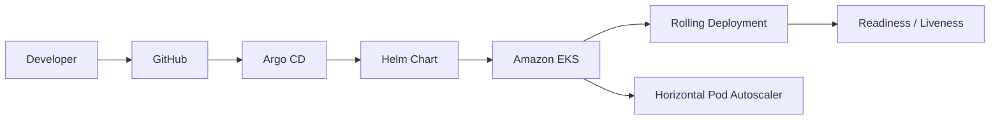

# EKS ArgoCD GitOps Platform

Production-style GitOps portfolio project demonstrating Kubernetes application delivery to Amazon EKS using Helm and Argo CD.

> **Portfolio safety:** this repository does not contain AWS credentials, kubeconfig files, or real application secrets. Deploying to a live EKS cluster can create AWS charges.

## Architecture



See [docs/gitops-workflow.md](docs/gitops-workflow.md) for the end-to-end reconciliation flow.

## What this demonstrates

- GitOps-style application delivery with Argo CD
- Reusable Helm chart structure
- Dev and prod environment-specific values
- Rolling Kubernetes deployments
- Readiness and liveness probes
- Resource requests and limits
- Horizontal Pod Autoscaling
- ConfigMap-driven application configuration
- Pod security controls
- CI validation with Helm lint and render checks

## Repository structure

```text
.
├── .github/
│   └── workflows/
│       └── validate.yml
├── app/
│   ├── app.py
│   ├── Dockerfile
│   └── requirements.txt
├── argocd/
│   ├── application-dev.yaml
│   └── application-prod.yaml
├── docs/
│   └── gitops-workflow.md
├── environments/
│   ├── dev-values.yaml
│   └── prod-values.yaml
├── helm/
│   └── sample-app/
│       ├── Chart.yaml
│       ├── values.yaml
│       └── templates/
│           ├── _helpers.tpl
│           ├── configmap.yaml
│           ├── deployment.yaml
│           ├── hpa.yaml
│           └── service.yaml
├── .gitignore
├── README.md
└── SECURITY.md
```

## Sample application

A minimal Flask API is included so the repository can demonstrate a complete container-to-cluster workflow.

Endpoints:

- `/` returns service and environment information
- `/health` returns HTTP 200 for Kubernetes probes

Build locally:

```bash
docker build -t sample-app:local app/
docker run --rm -p 8080:8080 -e APP_ENV=local sample-app:local
```

Verify:

```bash
curl http://localhost:8080/
curl http://localhost:8080/health
```

## Helm validation

Install Helm and run:

```bash
helm lint helm/sample-app
helm template sample-app-dev helm/sample-app -f environments/dev-values.yaml
helm template sample-app-prod helm/sample-app -f environments/prod-values.yaml
```

## Kubernetes controls

The Helm chart includes:

- rolling update strategy with `maxUnavailable: 0`
- readiness probe
- liveness probe
- CPU/memory requests and limits
- HPA using CPU utilization
- non-root pod execution
- RuntimeDefault seccomp
- privilege escalation disabled
- dropped Linux capabilities
- read-only root filesystem

## Argo CD applications

The repository contains separate Argo CD `Application` manifests for dev and prod.

Dev:

```bash
kubectl apply -f argocd/application-dev.yaml
```

Prod:

```bash
kubectl apply -f argocd/application-prod.yaml
```

These manifests assume Argo CD is already installed in the `argocd` namespace and the repository is reachable from the cluster.

## GitOps flow

1. Update the image tag or environment values in Git.
2. Open a pull request and review the change.
3. Merge the approved change.
4. Argo CD detects desired-state changes.
5. Helm renders the manifests.
6. Argo CD reconciles the target namespace.
7. Kubernetes performs a rolling update.
8. Readiness checks prevent unhealthy pods from receiving traffic.
9. Argo CD self-heals supported manual drift and prunes removed resources.

## Environment model

| Environment | Replicas | HPA min/max | CPU target |
|---|---:|---:|---:|
| dev | 2 | 2 / 4 | 70% |
| prod | 3 | 3 / 8 | 65% |

These are demonstration values rather than universal production sizing recommendations.

## Image strategy

The default values reference:

```text
ghcr.io/pranay9-h/sample-app:latest
```

For an actual deployment, replace `latest` with an immutable version or digest produced by your CI pipeline.

A production GitOps workflow should promote immutable image references rather than relying on mutable tags.

## CI validation

Pull requests and pushes to `master` run:

1. Helm lint
2. dev manifest rendering
3. prod manifest rendering
4. non-empty manifest verification

No cluster credentials are required for these checks.

## Secrets

This repository intentionally does not commit a Kubernetes `Secret` with real values.

In a production design, use an approved external secret store and integration rather than putting secrets in Git.

See [SECURITY.md](SECURITY.md).

## Prerequisites for live deployment

- a reachable Kubernetes/EKS cluster
- `kubectl`
- Helm
- Argo CD installed
- container image available in a registry
- metrics-server installed if HPA is expected to scale on resource metrics

## Troubleshooting

Check application state:

```bash
kubectl get pods -n sample-app-dev
kubectl get deployment -n sample-app-dev
kubectl get hpa -n sample-app-dev
```

Inspect a failing pod:

```bash
kubectl describe pod <pod-name> -n sample-app-dev
kubectl logs <pod-name> -n sample-app-dev
```

Check rollout:

```bash
kubectl rollout status deployment/sample-app-dev-sample-app -n sample-app-dev
```

Check Argo CD objects:

```bash
kubectl get applications -n argocd
```

## Cleanup

Remove Argo CD applications:

```bash
kubectl delete -f argocd/application-dev.yaml
kubectl delete -f argocd/application-prod.yaml
```

Because automated pruning is enabled, removing the Argo CD applications should be planned carefully for a real environment.

If the EKS cluster itself was created from the separate Terraform portfolio repository, destroy that infrastructure from the Terraform repository only after application cleanup.

## Interview discussion points

This project is intentionally structured to support technical interviews around:

- GitOps vs push-based deployment
- Argo CD reconciliation and self-healing
- Helm values and environment separation
- rolling update behavior
- readiness vs liveness probes
- HPA prerequisites and resource metrics
- immutable image promotion
- ConfigMaps vs Secrets
- pod security controls
- drift management and rollback strategy

## Author

Pranay Saiteja Soppadandi  
GitHub: https://github.com/pranay9-h
