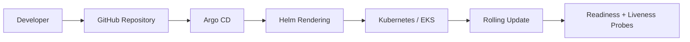

# GitOps Workflow

## Flow

1. A developer changes application configuration or an image tag in Git.
2. The change is reviewed and merged.
3. Argo CD detects Git/Kubernetes drift.
4. Helm renders the desired manifests.
5. Argo CD reconciles the target namespace.
6. Kubernetes performs a rolling update.
7. Readiness and liveness probes protect traffic from unhealthy pods.
8. Argo CD self-heals manual drift and prunes deleted resources when automated sync is enabled.
